<div align="center">
    <h3>Αριστοτέλειο Πανεπιστήμιο Θεσσαλονίκης</h3>
    <h1><b>Εισαγωγή στον Εξομοιωτή gem5</b></h1>
    <h3>Αρχιτεκτονική Υπολογιστών Χειμ. 2025-2026</h3>
    <p>
        <b>Ζήσης Κατσάρος - 10666</b><br>
        <small>Διδάσκων: Ιωάννης Παπαευσταθίου</small>
    </p>
</div>


## <b>1. Εισαγωγή</b>

Η παρούσα εργασία αφορά την εξομοίωση υπολογιστικών συστημάτων χρήση του εργαλίου Gem5. Παρακάτω θα παρουσιαστεί μία σειρά από διαδικασίες οι οποίες αποσκοπούν στην εξοικίωση με τον εξομοιωτή με απώτερο σκοπό στην τελευταία ενότητα να δοκιμαστούν διάφορες σχεδιάσεις της κρυφής μνήμης, να γίνει σύγκριση μεταξύ τους και να αναδειχθεί η επιτυχέστερη.


## <b>2. Μέρος 1ο</b>

Στο πρώτο μέρος θα διερευνηθεί η λειτουργία του εξομοιωτή, θα εκτελεστούν οι πρώτες εξομοιώσεις και θα αναλυθούν τα αποτελέσματά τους.

### 2.1 Βασικά χαρακτηριστικά του συστήματος

Τα βασικά χαρακτηριστικά του συστήματος του αρχείου `starter_se.py` είναι τα εξής:

#### Processor

- **Type:** AtomicSimpleCPU, Minor, HPI
- **Frequency:** 1GHz by default
- **Number of Cores:** 1 by default
- **Voltage:** 1.2V

#### Caches

- **Cache line size:** 64 bytes
- **Atomic:** no caches by default
- **Minor or HPI:** L1 instruction Cache, L1 Data Cache, shared L2 Cache

#### Memory

- **Type:** DDR3_1600_8x8
- **Size:** 2GB
- **Channels:** 2

#### System Interconnect

- **Memory Bus:** SystemXBar
- **Voltage Domain:** general system components 3.3V

### 2.2 Επιβεβαίωση χαρακτηριστικών από config files

Τα αρχεία `config.ini` και `config.json` παρέχουν πληροφορίες οι οποίες επιβεβαιώνουν όσα παρουσιάστηκαν στο προηγούμενο ερώτημα. Συγκεκριμένα:

#### Τύπος επεξεργαστή

**config.ini:**
```ini
[system.cpu_cluster.cpus]
type=MinorCPU
```

#### Συχνότητα λειτουργίας

**config.ini:**
```ini
[system.cpu_cluster.clk_domain]
type=SrcClockDomain
clock=1000
```

όπου το 1000 αντιστοιχεί σε περίοδο 1000ps επομένως συχνότητα 1GHz.

#### Πυρήνες

Υπάρχει ένας πυρήνας εφόσον υπάρχει μία μόνο καταχώρηση CPU με αριθμό νημάτων 1.

**config.ini:**
```ini
[system.cpu_cluster.cpus]
...
cpu_id=0
numThreads=1
```

#### Κρυφή Μνήμη

**L1 Instruction 48kB**

**config.ini:**
```ini
[system.cpu_cluster.cpus.icache]
...
size=49152
```

**L1 Data 32kB**

**config.ini:**
```ini
[system.cpu_cluster.cpus.dcache]
...
size=32768
```

**L2 1MB**

**config.ini:**
```ini
[system.cpu_cluster.l2]
...
size=1048576
```

#### Κύρια Μνήμη

Η μνήμη RAM έχει μέγεθος 2GB. Αυτό φαίνεται από το γεγονός ότι οι διεθύνσεις της μνήμης απαριθμούνται από το 0 έως τον αριθμό 2x1024³-1.

**config.ini:**
```ini
[system]
...
mem_ranges=0:2147483647
```

#### Τάση λειτουργίας

**config.ini:**
```ini
[system.cpu_cluster.voltage_domain]
...
voltage=1.2
```

### 2.3 Στατιστικά εξομοίωσης

Το αρχείο `stats.txt` παρέχει σημαντικές πληροφορίες για το προς εξομοίωση σύστημα. Ανάμεσα σε αυτές είναι οι εξής [1]:

- **sim_seconds:** Αναγράφει τον χρόνο εξομοίωσης δηλαδή πόσος χρόνος θα χρειαζόταν για την εκτέλεση του προγράμματος εάν το εξομοιωμένο σύστημα ήταν πραγματικό hardware

- **sim_ticks:** Είναι ο αριθμός των κύκλων ρολογιού που χρειάστηκαν για την εκτέλεση του προγράμματος

- **sim_insts:** Είναι ο συνολικός αριθμός των εντολών που εξομοιώθηκαν

- **host_inst_rate:** Μετράει πόσες εντολές εξομοιώνει το host σύστημα το δευτερόλεπτο

### 2.4 Committed εντολές και προσπελάσεις κρυφής μνήμης

Ο συνολικός αριθμός "committed" εντολών βρίσκεται στο αρχείο `stats.txt` στο πεδίο `sim_insts` και ισούται με 5027. Οι "committed" εντολές είναι οι εντολές που ολοκληρώθηκαν, έτσι οι διαφορές με άλλα στατιστικά αφορούν εντολές που άρχισαν αλλά δεν ολοκληρώθηκαν πχ. σε περίπτωση εσφαλμένων branch-prediction ή pipeline.

Για να βρεθεί ο συνολικός αριθμός προσπελάσεων των κρυφών μνημών αρκεί να ελεγχθεί το αρχείο `stats.txt`. Στο πεδίο `system.cpu_cluster.cpus.dcache.overall_accesses::total` αναγράφεται ο αριθμός προσπελάσεων της L1 data cache ο οποίος είναι 2160. Αντίστοιχα από το πεδίο `system.cpu_cluster.l2.overall_accesses::total` προκύπτει ότι η L2 προσπελάστηκε 474 φορές.

Εάν δεν παρέχονταν απευθείας οι δύο αυτοί αριθμοί θα μπορούσαν να υπολογιστούν εφόσον αθροίσουμε τις εντολές εγγραφής και ανάγνωσης στην μνήμη για τον αριθμό των προσπελάσεων της L1 και εφόσον ανακαλέσουμε τον αριθμό misses κατά την ανάγνωση της L1 για την L2.

### 2.5 Μοντέλα επεξεργαστή

Σε αυτό το σημείο θα αφιερωθεί μία παράγραφος για κάθε μοντέλο in-order επεξεργαστή που χρησιμοποιεί ο gem5:

#### SimpleCPU

Ο SimpleCPU χρησιμοποιείται σε περιπτώσεις όπου δεν απαιτήται μεγάλος βαθμός λεπτομέρειας. Χωρίζεται σε τρεις κλάσεις, την BaseSimpleCPU, την AtomicSimpleCPU και την TimingSimpleCPU. Η BaseSimpleCPU είναι η βάση την οποία κληρονομούν οι δύο επόμενες. Η AtomicSimpleCPU χρησιμοποιεί atomic memory προσπελάσεις ενώ η TimingSimpleCPU χρησιμοποιεί timing memory προσπελάσεις [2].

#### Minor

Ο MinorCPU είναι ένας λεπτομερής επεξεργαστής με διοχέτευση σκοπός του οποίου είναι η μοντελοποίηση επεξεργαστών με αυστηρά in-order συμπεριφορά. Το συγκεκριμένο μοντέλο δεν υποστηρίζει multithreading και όσον αφορά τις δομές δεδομένων, όλες αρχικοποιούνται με σταθερό μέγεθος [3].

### 2.6 Σύγκριση TimingSimpleCPU και MinorCPU

Στο παρόν ερώτημα ζητείται να κατασκευαστεί ένα πρόγραμμα σε C, το οποίο υπολογίζει το άθροισμα των αριθμών μέχρι έναν δωθέντα αριθμό N και στην συνέχεια να εκτελεστεί στον gem5 χρησιμοποιώντας TimingSimpleCPU και MinorCPU. Έτσι, υλοποιήθηκε το αρχείο `sum_of_ints_up_to_N.c` και από τις εξωμοιώσεις προκύπτει ότι ο χρόνος εκτέλεσης είναι 0.000038 sec. και 0.000034 sec. χρήση του TimingSimpleCPU και του MinorCPU αντίστοιχα.

Το γεγονός ότι ο MinorCPU χρειάστηκε μικρότερο χρόνο εκτέλεσης συνάδει με όσα αναφέρθηκαν προηγουμένως. Η καλύτερη απόδοση μπορεί να εξηγηθεί από το γεγονός ότι ο MinorCPU έχει διοχέτευση ενώ ο TimingCPU όχι.

Συνεχίζοντας, έγιναν επιπλέον εξωμοιώσεις χρήση αυτών των δύο επεξεργαστών μεταβάλλοντας την συχνότητα λειτουργίας και την τεχνολογία μνήμης. Προέκυψαν οι εξής χρόνοι εκτέλεσης:

- TimingSimpleCPU με συχνότητα 250MHz: 0.000130 sec.
- MinorCPU με συχνότητα 250MHz: 0.000085 sec.
- TimingSimpleCPU με μνήμη DDR4: 0.000038 sec.
- MinorCPU με μνήμη DDR4: 0.000033 sec.

Τα αποτελέσματα είναι αναμενόμενα. Η μείωση της συχνότητας επέφερε αύξηση του χρόνου εκτέλεσης με μεγαλύτερη αύξηση στην περίπτωση του TimingSimpleCPU, η οποία εξηγείται από το γεγονός ότι ο MinorCPU αξιοποιεί pipeline ενώ ο TimingSimpleCPU όχι. Επιπλέον, η αλλαγή σε πιο σύγχρονη τεχνολογία μνήμης δεν επέφερε σημαντική μεταβολή του χρόνου εκτέλεσης το οποίο μπορεί να εξηγηθεί από την απλοικότητα του προγράμματος.


## 3. <b>Μέρος 2ο</b>

### 3.1 Βήμα 1ο

Στο 2ο μέρος της εργασίας θα εκτελεστούν 5 benchmarks από το σύνολο SPEC CPU2006 και θα καταγραφούν ορισμένα αποτελέσματα που προέκυψαν από τις εξωμοιώσεις. Για μεγαλύτερη ευκολία δημιουργήθηκε το bash script `run_benchmarks.sh` το οποίο κατά την εκτέλεσή του επιτρέπει την διαδοχική εξομοίωση των 5 benchmarks.

#### Χαρακτηριστικά υποσυστημάτων μνήμης

Από τα αρχεία `config.ini` προκύπτουν οι εξής πληροφορίες σχετικά με τα υποσυστήματα μνήμης:

- **L1 instruction size:** 32kB
- **L1 data size:** 64kB
- **L2 size:** 2MB
- **Associativity:** L1 2-way, L2 8-way
- **Cache line size:** 64 Bytes
- **Memory type:** DRAMCtrl
- **Memory size:** 512 MB

#### Αποτελέσματα Benchmarks

<div align="center">

| Benchmark | Exec. Time (s) | CPI      | L1D missrate | L1I missrate | L2 missrate | Num. of Instructions |
|-----------|----------------|----------|--------------|--------------|-------------|----------------------|
| bzip      | 0.083982       | 1.679650 | 0.014798     | 0.000077     | 0.282163    | 100,000,001          |
| hmmer     | 0.059396       | 1.187917 | 0.001637     | 0.000221     | 0.077760    | 100,000,000          |
| libm      | 0.174671       | 3.493415 | 0.060972     | 0.000094     | 0.999944    | 100,000,000          |
| mcf       | 0.064955       | 1.299095 | 0.002108     | 0.023612     | 0.055046    | 100,000,001          |
| sjeng     | 0.513528       | 10.270554| 0.121831     | 0.000020     | 0.999972    | 100,000,000          |

**Table 1:** Αποτελέσματα εξομοίωσης 5 SPEC CPU2006 benchmarks

</div>

Τα παραπάνω δεδομένα αναπαρίστανται και σε μορφή "bar graph" τα οποία κατασκευάστηκαν μέσω του python script `benchmark_bar_graphs.py`.

<div align="center">

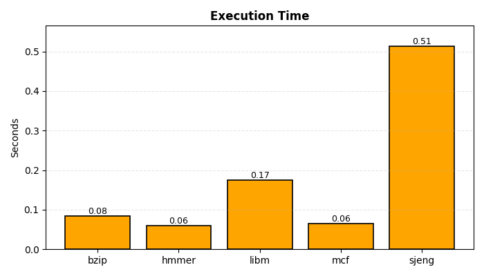

**Figure 1:** Χρόνος εκτέλεσης benchmarks

</div>

<div align="center">

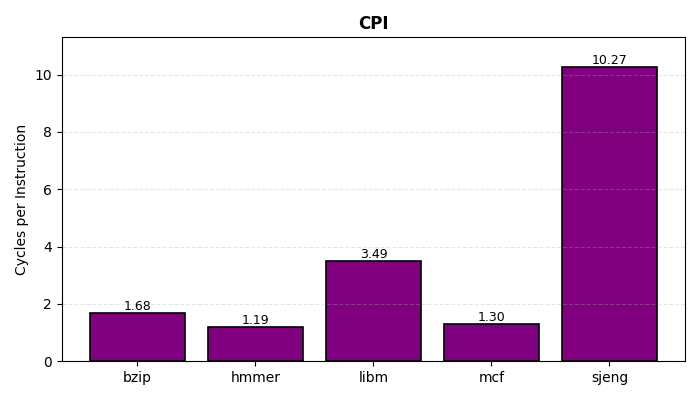

**Figure 2:** Cycles Per Instruction για κάθε benchmark

</div>

<div align="center">

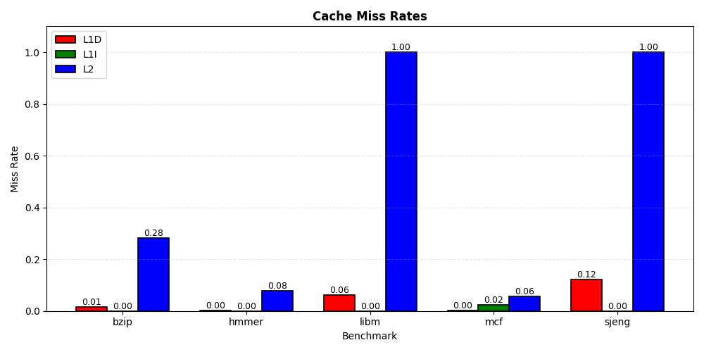

**Figure 3:** Ποσοστά αστοχίας κρυφής μνήμης

</div>

#### Παρατηρήσεις

Από τα παραπάνω γραφήματα είναι εμφανές ότι καθοριστικό ρόλο στους απαιτούμενους κύκλους ανά εντολή καθώς και στον χρόνο εκτέλεσης παίζει το ποσοστό των L2 cache misses. Είναι γνωστό ότι η διαδικασία ανάγνωσης δεδομένων από την κύρια μνήμη είναι μία εξαιρετικά αργή διαδικασία και ως εκ τούτου τα υψηλά ποσοστά L2 cache misses οδηγούν σε μεγάλη αύξηση του CPI και του χρόνου εκτέλεσης. Κάτι τέτοιο παρατηρείται κατά την εκτέλεση των libm και sjeng, ενώ τα υπόλοιπα τρία παρουσιάζουν χαμηλά ποσοστά αστοχίας στην L2 και συνεπακόλουθα χαμηλά CPI και χρόνο execution time.

#### Επίδραση συχνότητας και τεχνολογίας μνήμης

Για το παρόν ερώτημα εκτελέστηκαν τα ίδια 5 benchmarks δύο φορές το καθένα. Την πρώτη φορά η συχνότητα του επεξεργαστή τέθηκε στo 1GHz, ενώ την δεύτερη στα 4GHz. Χάριν ευκολίας χρησιμοποιήθηκε το bash script `run_benchmarks_freq.sh`.

Παρατηρώντας τα αρχεία `stats.txt` και συγκεκριμένα τα πεδία `system.clk_domain.clock` και `system.cpu_clk_domain.clock` γίνεται αντιληπτό ότι η τιμή `system.clk_domain.clock` μένει σταθερή στα 1000 ενώ `system.cpu_clk_domain.clock` μεταβάλεται ώστε να αναγράφει την περίοδο του ρολογιού σε ticks. Συγκεκριμένα αρχικά είναι 500 ticks, δηλαδή 500ps άρα η συχνότητα ισούται με 2GHz, στην δοκιμή με `--cpu-clock=1GHz` είναι 1000ps άρα 1GHz και τέλος στην δοκιμή με `--cpu-clock=4GHz` είναι 250ps άρα 4GHz.

Από τα ονόματα των δύο πεδίων αφήνεται να εννοηθεί ότι το `system.cpu_clk_domain.clock` αναφέρεται στην συχνότητα λειτουργίας του επεξεργαστή, ενώ το `system.clk_domain.clock` αναφέρεται στην συχνότητα λειτουργίας του υπόλοιπου συστήματος. Αυτό πιθανότατα συμβαίνει για να μοντελοποιηθεί η συμπεριφορά που έχουν τα πραγματικά συστήματα με ακρίβεια.

Παρατηρώντας το αρχείο `config.json` επιβεβαιώνονται όσα αναφέρθηκαν παραπάνω. Συγκεκριμένα, η τιμή `system.clk_domain` εμφανίζεται στα στοιχεία `membus`, `mem_ctrls` και `dvfs_handler`, τα οποία αποτελούν το δίαυλο ανάμεσα στην L2 και την RAM, ελεγχτές της μνήμης και τον ελεγτή τάσης και συχνότητας αντίστοιχα. Πρόκειται, λοιπόν, για στοιχεία τα οποία δεν αφορούν τον επεξεργαστή αλλά το υπόλοιπο σύστημα. Αντίστοιχα η τιμή `system.cpu_clk_domain` απαντάται (εντός άλλων) στα εξής στοιχεία της CPU: `tol2bus` (δίαυλος ανάμεσα σε L1 και L2), `icache` και `dcache` (L1), L2 και την ίδια την CPU. Επιπλέον, αναφέρεται ότι εάν προστεθεί άλλη μία CPU θα χρονιστεί με συχνότητα `system.cpu_clk_domain` σύμφωνα με τις εξής γραμμές του `se.py`:

**se.py:**
```python
# All cpus belong to a common cpu_clk_domain, therefore running at a common
# frequency.
for cpu in system.cpu:
    cpu.clk_domain = system.cpu_clk_domain
```

Οι χρόνοι εκτέλεσης των benchmark συνοψίζονται στον παρακάτω πίνακα:

<div align="center">

| Benchmark | initial  | 1GHz     | 4GHz     |
|-----------|----------|----------|----------|
| bzip      | 0.083982 | 0.161025 | 0.045678 |
| hmmer     | 0.059396 | 0.118530 | 0.029829 |
| libm      | 0.174671 | 0.262327 | 0.131829 |
| mcf       | 0.064955 | 0.127942 | 0.033496 |
| sjeng     | 0.513528 | 0.704056 | 0.417558 |

**Table 2:** Χρόνοι εκτέλεσης σε διαφορετικές συχνότητες

</div>

Όπως ήταν αναμενόμενο δεν παρατηρείται τέλειο scaling πράγμα που πηγάζει από τις δύο ξεχωριστές συχνότητες λειτουργίας ανάμεσα στην CPU και το υπόλοιπο σύστημα. Εφόσον η συχνότητα λειτουργίας του (εκτός της CPU) συστήματος μένει σταθερή, οι χρόνοι προσπέλασης της κύριας μνήμης μένουν επίσης σταθεροί, γεγονός που αποτρέπει το τέλειο scaling. Αυτό γίνεται ιδιαίτερα αντιληπτό στα benchmarks libm και sjeng όπου τα ποσοστά αστοχιών της L2 είναι πολύ υψηλά άρα και οι προσπελάσεις της RAM συχνές. Αντίθετα στα υπόλοιπα benchmarks, όπου τα L2 misses είναι λιγότερα οι χρόνοι εκτέλεσης είναι πιο κοντά σε τέλειο scaling.

#### Μνήμη DDR3_2133_x64

Εν συνεχεία, εκτελέστηκε το benchmark bzip χρήση μνήμης DDR3_2133_x64 (συχνότητα λειτουργίας στην default τιμή, 2GHz). Κατόπην ολοκλήρωσης της εξομοίωσης προκύπτει ότι ο χρόνος εκτέλεσης είναι 0.083609 sec., το CPI 1.672175 ενώ φυσικά τα ποσοστά αστοχιών έμειναν σταθερά. Αυτό που παρατηρούμε είναι μικρή μείωση τόσο στον χρόνο εκτέλεσης όσο και στο CPI. Αυτό είναι αναμενόμενο καθώς το γρηγορότερο ρολόι της DDR3_2133_x64 επιτρέπει γρηγορότερη ανάκτηση δεδομένων από την κύρια μνήμη κι έτσι ο συνολικός χρόνος εκτέλεσης μειώνεται. Το γεγονός ότι η μείωση ήταν αρκετά μικρή εξηγείται από το γεγονός ότι το ποσοστό αστοχιών της L2 στο συγκεκριμένο benchmark είναι σχετικά χαμηλό, άρα η επίδραση του γρηγορότερου ρολογιού είναι περιορισμένη.

### 3.2 Βήμα 2ο

Το δεύτερο βήμα αυτού του μέρους της εργασίας αφορά την διερεύνηση της επίδρασης των διάφορων παραμέτρων ενός συστήματος στην επίδωσή του πάνω στα benchmarks. Οι παράμετροι οι οποίες θα μελετηθούν είναι το μέγεθος και το associativity των L1 και L2 και το μέγεθος του cache line.

#### Περιορισμός των δοκιμών

Ο συνολικός αριθμός των συνδιασμών που μπορούν να προκύψουν από όλες τις πιθανές τιμές των παραπάνω παραμέτρων είναι τόσο μεγάλος που είναι ασύμφορο να εκτελεστεί δοκιμή για καθέναν από αυτούς. Έτσι, θα χρησιμοποιηθούν όσα παρατηρήθηκαν στο προηγούμενο βήμα ώστε να περιοριστεί ο αριθμός των δοκιμών.

Αρχικά, όσον αφορά το μέγεθος της L1I θα αποφευχθούν οι δοκιμές με μεγέθη μικρότερα των 32kB καθώς στο benchmark mcf ήδη εμφανίστηκαν αστοχίες. Επιπλέον, εφόσον παρατηρήθηκε ότι σε δύο από τα πέντε benchmark (libm και sjeng) το missrate της L2 ήταν σχεδόν 100% θα γίνουν αποκλειστικά δοκιμές με το μέγιστο δυνατό μέγεθος L2, δηλαδή 4MB. Επίσης, για να αποφευχθεί μεγάλη αύξηση του latency το associativity δεν θα ξεπεράσει το 16-way. Τέλος, δεν θα γίνει μείωση του μεγέθους της cache line στα 32B, θα γίνουν δοκιμές με 64, 128 και 256B.

Έχοντας υπόψην τα παραπάνω, λοιπόν, προτείνεται η εκτέλεση των δοκιμών που φαίνονται στον παρακάτω πίνακα. Οι δοκιμές I αφορούν το μέγεθος της L1, οι δοκιμές II αφορούν το associativity και οι III το μέγεθος της cache line.

<div align="center">

| Test   | L1I Size | L1D Size | L2 Size | L1D Assoc | L2 Assoc | Cache Line Size |
|--------|----------|----------|---------|-----------|----------|-----------------|
| I(a)   | 32kB     | 64kB     | 4MB     | 2-way     | 8-way    | 64B             |
| I(b)   | 32kB     | 128kB    | 4MB     | 2-way     | 8-way    | 64B             |
| I(c)   | 64kB     | 128kB    | 4MB     | 2-way     | 8-way    | 64B             |
| II(a)  | 32kB     | 64kB     | 4MB     | 4-way     | 8-way    | 64B             |
| II(b)  | 32kB     | 64kB     | 4MB     | 8-way     | 8-way    | 64B             |
| II(c)  | 32kB     | 64kB     | 4MB     | 4-way     | 16-way   | 64B             |
| III(a) | 32kB     | 64kB     | 4MB     | 4-way     | 8-way    | 128B            |
| III(b) | 32kB     | 64kB     | 4MB     | 4-way     | 8-way    | 256B            |

**Table 3:** Σχεδίαση δοκιμών για μεταβολή παραμέτρων cache

</div>

Πρωτού αναλυθούν τα αποτελέσματα είναι σημαντικό να αναφερθεί πως για να ξεκινήσουν οι εξωμοιώσεις αλλά και να αποθηκευτούν τα αποτελέσματα τους αυτόματα χρησιμοποιήθηκε το bash script του αρχείου `part2step2.sh`. Το script μπορεί να χωριστεί σε τρία μέρη. Στο πρώτο αρχικοποιούνται ορισμένα στοιχεία, όπως τα paths των benchmarks, το path του gem5, τα βασικά ορίσματα του αρχείου `se.py` ώστε οι μετέπειτα σειρές να γίνουν πιο απλές και αναγνώσιμες. Στην συνέχεια, ακολουθεί ένας βρόχος ο οποίος εκτελεί τις δοκιμές I(a) έως III(b) για όλα τα benchmark. Τέλος, αφότου ολοκληρωθούν οι εξωμοιώσεις, κατασκευάζεται ένα .ini αρχείο το οποίο χρησιμοποιείται για να δημιουργηθεί μέσω του `read_results.sh` ένα .txt αρχείο με έναν πίνακα που περιέχει το CPI, τα missrates των δύο επιπέδων και τον χρόνο εκτέλεσης.

#### Ανάλυση επίδρασης παραμέτρων

Για να δειχθεί πως επιδρά κάθε παράμετρος στην απόδοση κάθε benchmark υλοποιήθηκε το script `cpi_benchmarks_bar_graphs.py` το οποίο δημιουργεί για το κάθε benchmark ένα γράφημα που παρηστάνει το CPI σε κάθε δοκιμή. Τα γραφήματα αυτά φαίνονται παρακάτω:

<div align="center">

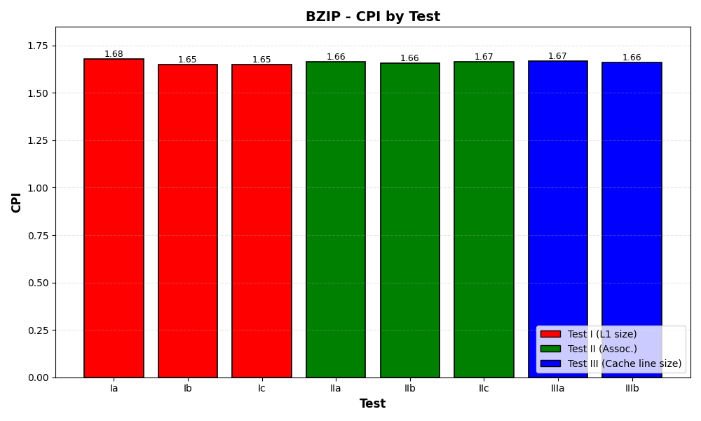

**Figure 4:** Επίδραση παραμέτρων cache στο CPI του bzip

</div>

<div align="center">

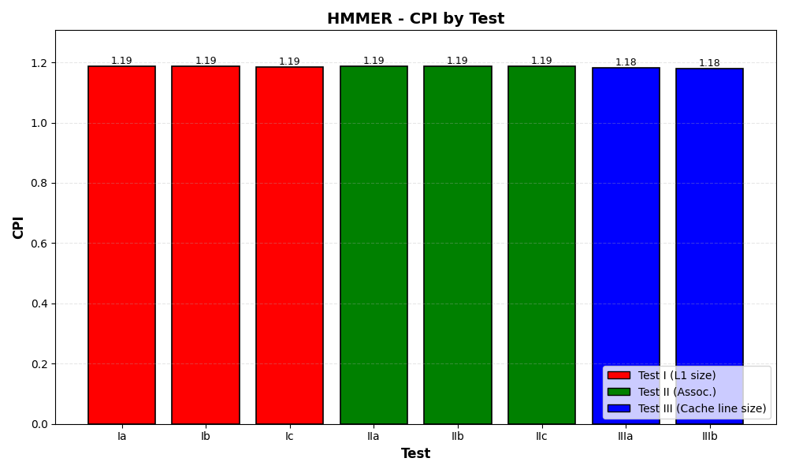

**Figure 5:** Επίδραση παραμέτρων cache στο CPI του hmmer

</div>

<div align="center">

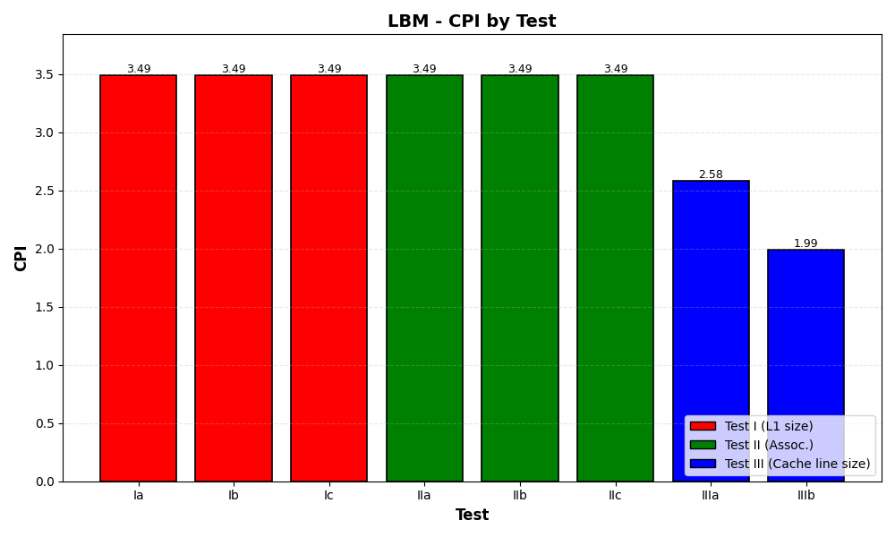

**Figure 6:** Επίδραση παραμέτρων cache στο CPI του libm

</div>

<div align="center">

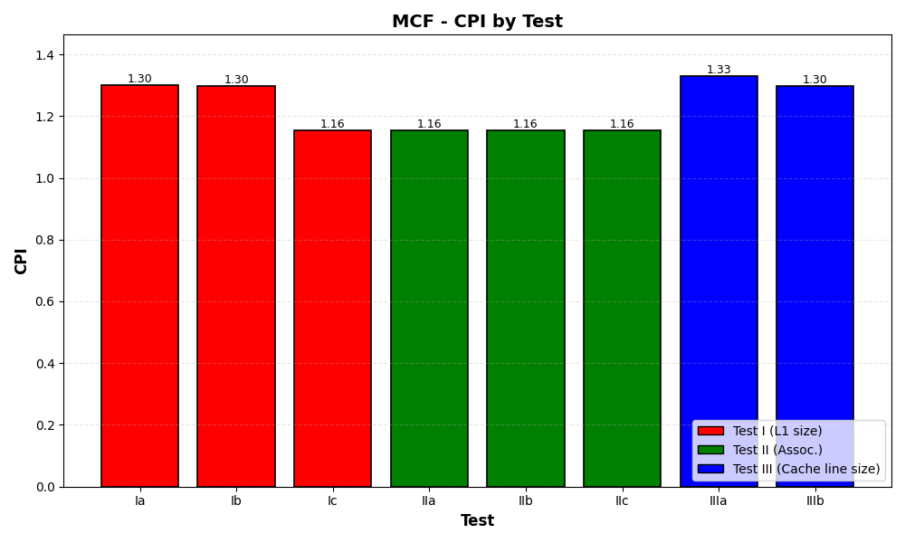

**Figure 7:** Επίδραση παραμέτρων cache στο CPI του mcf

</div>

<div align="center">

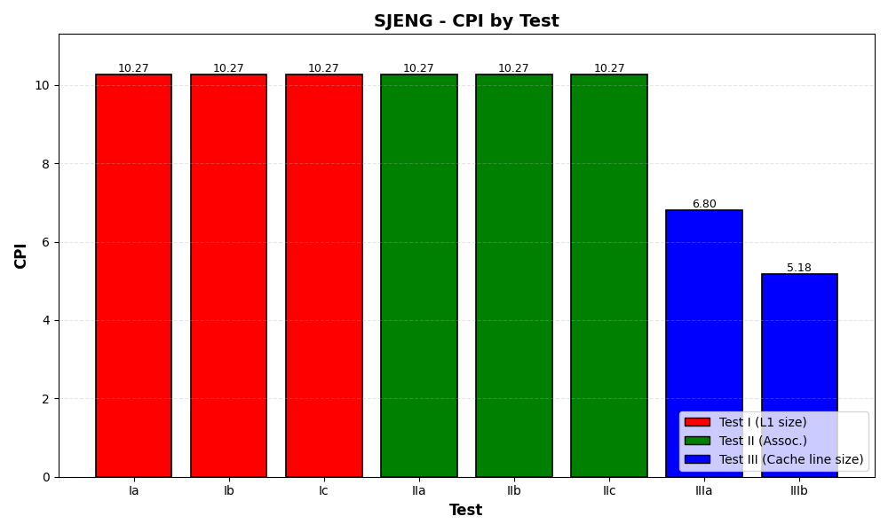

**Figure 8:** Επίδραση παραμέτρων cache στο CPI του sjeng

</div>

##### Παρατηρήσεις

**bzip:** Όσον αφορά το benchmark bzip αυτό που είχε θετικότερη επίδραση στο CPI είναι η αύξηση του μεγέθους της L1 τόσο της instruction όσο data που παρατηρείται στις δοκιμές I(b) και I(c). Η μεταβολή του associativity και του cache line size είχαν επίσης θετική επίδραση, είναι όμως συγκριτικά μικρότερη.

**hmmer:** Το συγκεκριμένο benchmark παρουσίασε ήδη από τις εξωμοιώσεις του προηγούμενου βήματος πολύ χαμηλά ποσοστά αστοχίας. Όπως σε όλα τα benchmarks το L2 missrate είναι αρκετά μεγαλύτερο από τα L1d και L1i missrate. Έτσι, το καλύτερο CPI παρατηρήθηκε για αύξηση του cache line size (δοκιμή III(b)).

**libm:** Το benchmark libm παρουσιάζει L2 missrate σχεδόν 100%. Είναι, λοιπόν, αναμενόμενο ότι το καλύτερο CPI επιτυγχάνεται με αύξηση του cache line size.

**mcf:** Για το mcf καλύτερο CPI επιτυγχάνεται είτε με αύξηση της L1I είτε με αύξηση του associativity. Το πρώτο μπορεί να εξηγηθεί εύκολα εφόσον το benchmark αυτό έχει συγκριτικά με τα υπόλοιπα υψηλό L1I missrate, έτσι το μεγαλύτερο μέγεθος επιτρέπει περισσότερη πληροφορία η οποία μειώνει τις αστοχίες. Το δεύτερο αφήνει να εννοηθεί ότι το υψηλό missrate προέκυπτε από conflict misses. Έτσι, η αύξηση του associativity "έλυσε" τα conflicts και ως εκ τούτου μείωσε το L1I missrate.

**sjeng:** Τέλος, το sjeng όπως και το libm υποφέρει από L2 missrate σχεδόν 100%. Επομένως, η αύξηση του cache line size είναι μονόδρομος ώστε να μειωθεί το CPI.

#### Δοκιμές συνδυασμών

Εφόσον, παρουσιάστηκε η επίδραση της κάθε παραμέτρου ξεχωριστά, θα γίνουν παρακάτω μερικές επιπλέον δοκιμές ώστε να προκύψει ο συνδιασμός ο οποίος οδηγεί στο καλύτερο CPI. Οι δοκιμές οι οποίες θα πραγματοποιηθούν είναι οι εξής:

<div align="center">

| Test   | L1I Size | L1D Size | L2 Size | L1D Assoc | L2 Assoc | Cache Line Size |
|--------|----------|----------|---------|-----------|----------|-----------------|
| IV(a)  | 32kB     | 128kB    | 4MB     | 4-way     | 8-way    | 256B            |
| IV(b)  | 64kB     | 64kB     | 4MB     | 8-way     | 16-way   | 128B            |
| IV(c)  | 64kB     | 128kB    | 4MB     | 4-way     | 16-way   | 128B            |
| IV(d)  | 64kB     | 128kB    | 4MB     | 4-way     | 16-way   | 256B            |
| IV(e)  | 64kB     | 64kB     | 4MB     | 4-way     | 16-way   | 256B            |

**Table 4:** Σχεδίαση δοκιμών συνδυασμών παραμέτρων cache

</div>

Όπως και προηγουμένως θα δειχθούν γραφήματα τα οποία παρηστάνουν την επίδραση κάθε δοκιμής στο CPI κάθε benchmark. Τα γραφήματα αυτά δημιουργήθηκαν μέσω του script `combos_cpi_bar_graphs.py`.

<div align="center">

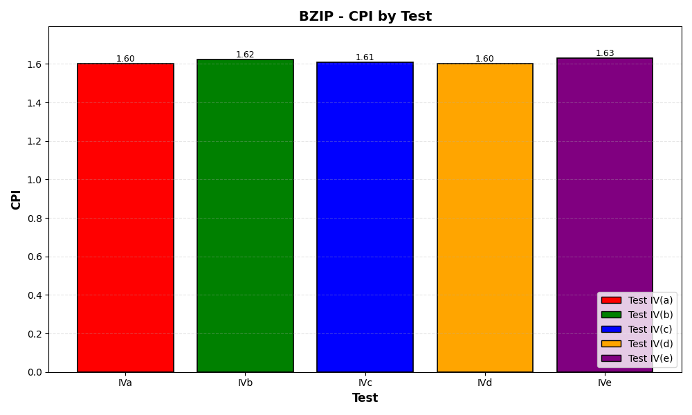

**Figure 9:** CPI του bzip σε δοκιμές συνδυασμών

</div>

<div align="center">

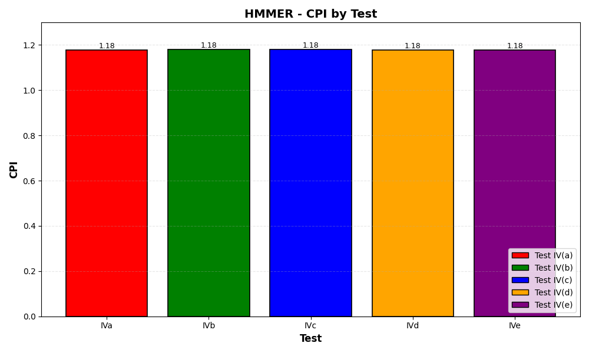

**Figure 10:** CPI του hmmer σε δοκιμές συνδυασμών

</div>

<div align="center">

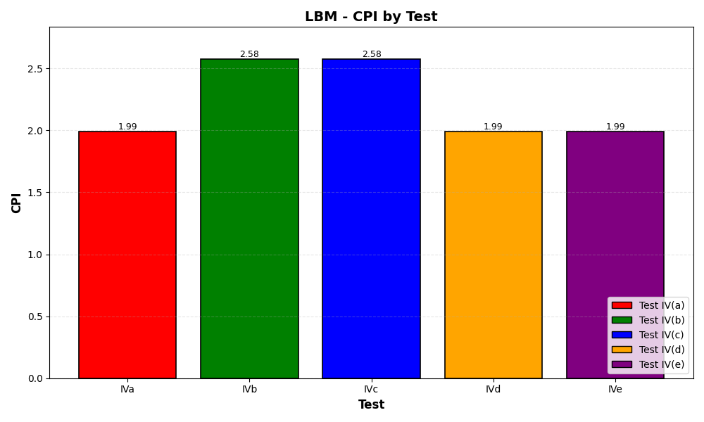

**Figure 11:** CPI του libm σε δοκιμές συνδυασμών

</div>

<div align="center">

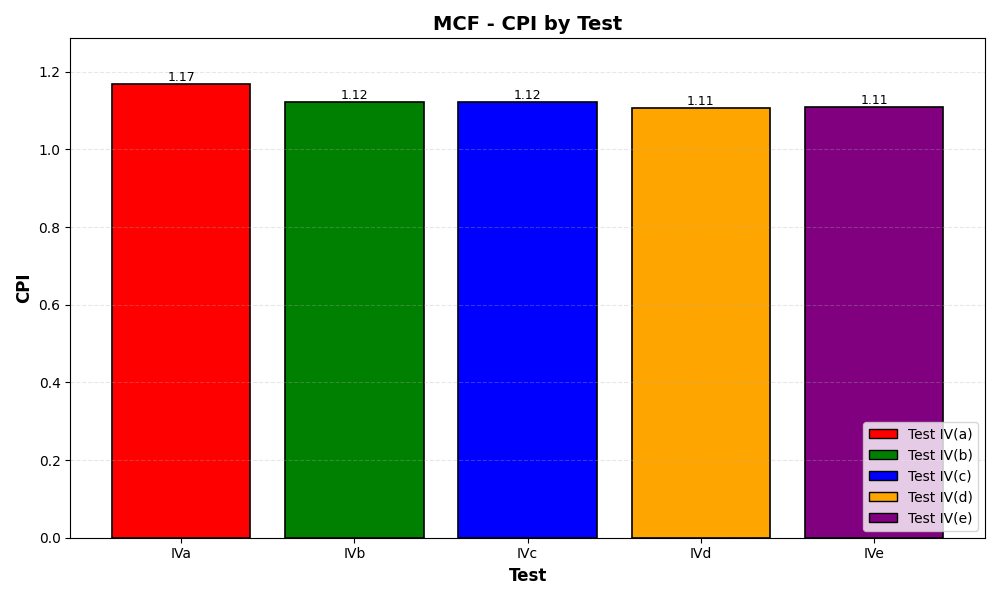

**Figure 12:** CPI του mcf σε δοκιμές συνδυασμών

</div>

<div align="center">


**Figure 13:** CPI του sjeng σε δοκιμές συνδυασμών

</div>

##### Παρατηρήσεις

Τα παραπάνω γραφήματα ακολουθούν την συμπεριφορά, η οποία περιγράφηκε προηγουμένως. Συγκεκριμένα η αύξηση του μεγέθους της cache line ευνοεί κατά πολύ τα libm και sjeng, η αύξηση του μεγέθους της L1I επιδρά θετικά στο mcf, το CPI του hmmer αντιδρά ελάχιστα στις αλλαγές και τέλος στο bzip έχουν θετικότερη επίπτωση η αύξηση του μεγέθους της L1D σε 128kB.

### 3.3 Βήμα 3ο

#### Συνάρτηση κόστους

Μέχρι στιγμής η ανάλυση περιορίστηκε εξολοκλήρου στην απόδωση κάθε σχεδίασης. Εξίσως σημαντικός παράγωντας, όμως, είναι και το κόστος κατασκευής. Για να γίνει, λοιπόν, εμφανές ποιά σχεδίαση παρουσιάζει την σχέση με την καλύτερη σχέση απόδοσης-τιμής, θα κατασκευαστεί μία συνάρτηση κόστους η οποία θα συνδιάζει τα δύο αυτά χαρακτηριστικά. Προτείνεται η παρακάτω συνάρτηση:

$$\text{cost} = (a \cdot \text{Size}_{L1} + b \cdot \text{Size}_{L2} + c \cdot N_{\text{assoc}_{L1}} + d \cdot N_{\text{assoc}_{L2}} + e/\text{Size}_{\text{cacheline}}) \cdot (\text{CPI})^f\cdot \text{1/norm}$$

Η προτεινόμενη συνάρτηση είναι το γινόμενο δύο όρων όπου ο πρώτος εκφράζει το κόστος κατασκευής και ο δεύτερος την απόδοση μέσω του CPI. Όσον αφορά τον πρώτο όρο πρόκειται για το σταθμισμένο άθροισμα του μεγέθους και το associativity των δύο επιπέδων cache συν το αντίστροφο του μεγέθους της cache line. Για να κατανοηθεί γιατί συμβαίνει αυτό αρκεί να σκεφτεί κανείς ότι για δεδομένο μέγεθος ενός επιπέδου της cache μεγαλύτερο block size οδηγεί σε λιγότερες γραμμές. Έτσι, μέρος του κυκλώματος ελέγχου της cache γίνεται μικρότερο το οποίο έχει θετική επίπτωση στο κόστος κατασκευής. Επιπλέον, όσον αφορά το associativity, για αύξησή του το κύκλωμα ελέγχου της cache μεγαλώνει και κατ' επέκταση και μεγαλώνει και το κόστος. Τέλος, τα μεγέθη των δύο επιπέδων της cache έχουν καθοριστικό ρόλο στο κόστος κατασκευής [4].

Τα βάρη $a$ έως $e$ τίθενται ως $a = 0.4$, $b = 0.1$, $c = 0.2$, $d = 0.3$, $e = 512$ ώστε σε συνδιασμό με την διαφορά στις τάξεις μεγέθους των αντίστοιχων παραμέτρων να αντικατοπτρήσουν όσο καλύτερα γίνεται την επίδραση τους.

Ο δεύτερος όρος πρόκειται για το CPI υψημένο σε κάποια δύναμη έτσι ώστε να ενισχυθούν οι (αρκετά μικρές) διαφορές ανάμεσα στα CPI των δοκιμών. Εδώ χρησιμοποιήθηκε $f = 2$. Τελευταία προτείνεται το γινόμενο να διαιρεθεί με κάποια δύναμη του 10 έτσι ώστε το κόστος να μην πάρει αχρείαστα μεγάλη τιμή. Εδώ χρησιμοποιήθηκε $\text{norm} = 100$, περιορίζοντας το κόστος σε μερικές δεκάδες για κάθε δοκιμή.

#### Αποτελέσματα ανάλυσης κόστους

Υπολογίζοντας λοιπόν τον μέσο όρο του CPI σε κάθε benchmark και εν συνεχεία εφαρμόζοντας την παραπάνω συνάρτηση προκύπτουν οι εξής τιμές:

- Test IV(a) - Cost: 23.28
- Test IV(b) - Cost: 33.46
- Test IV(c) - Cost: 33.59
- Test IV(d) - Cost: 23.13
- Test IV(e) - Cost: 23.12

Επομένως η σχεδίαση της δοκιμής IV(e) αναδεικνύεται ως αυτή με την καλύτερη σχέση απόδοσης-τιμής. Το αποτέλεσμα αυτό συμβαδίζει φυσικά με τις μετρήσεις του προηγούμενου βήματος μιάς και η δοκιμή IV(e) παρουσιάζει αρκετά καλά αποτελέσματα συγκριτικά με τις υπόλοιπες σε όλα τα benchmark, διατηρόντας όμως μικρότερο το μέγεθος της L1.


## Αναφορές

[1] https://www.gem5.org/documentation/learning_gem5/part1/gem5_stats/

[2] https://www.gem5.org/documentation/general_docs/cpu_models/SimpleCPU

[3] https://www.gem5.org/documentation/general_docs/cpu_models/minor_cpu

[4] John L. Hennessy, David A. Patterson - "Computer Architecture: A Quantitative Approach (6th edition)"
